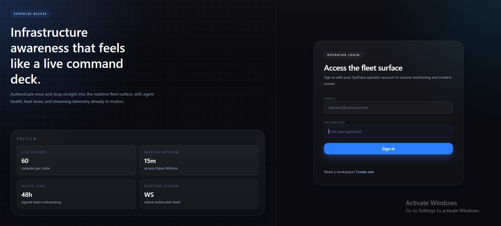
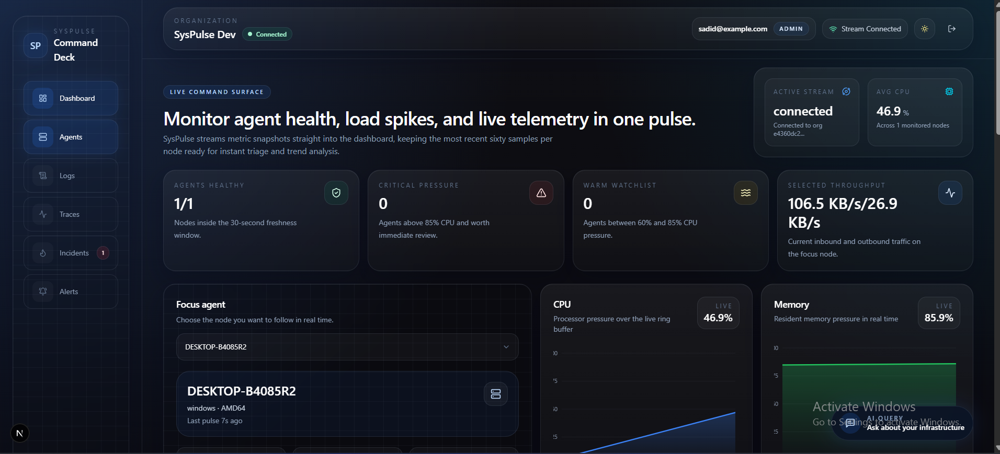
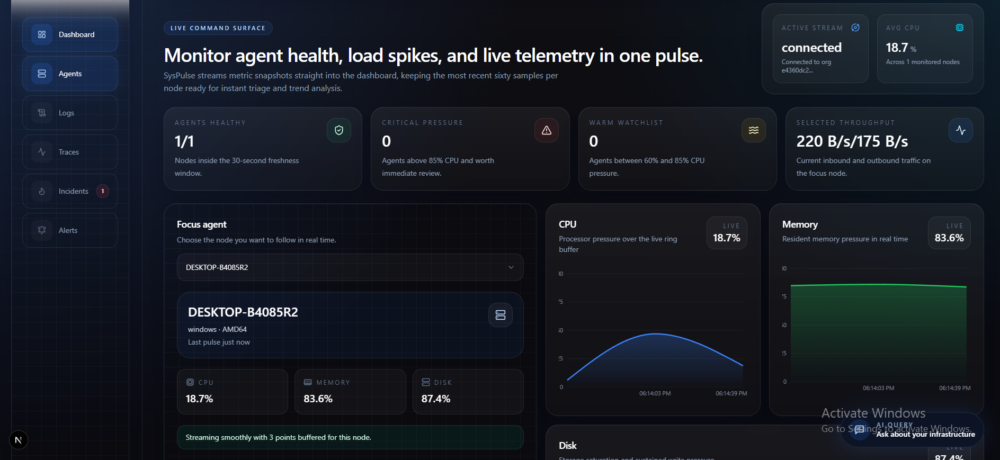
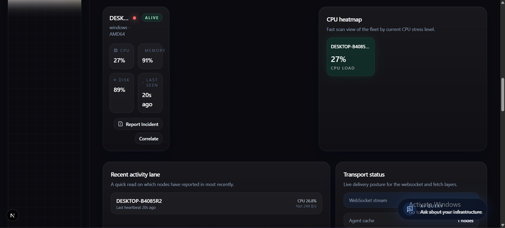
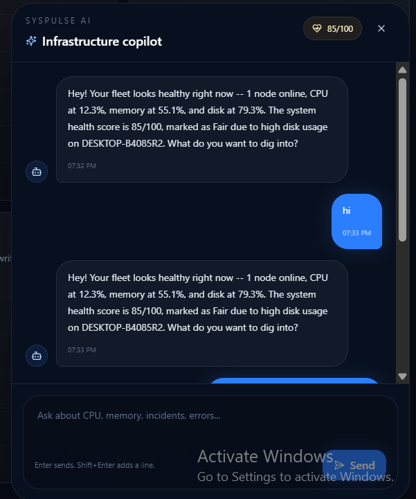
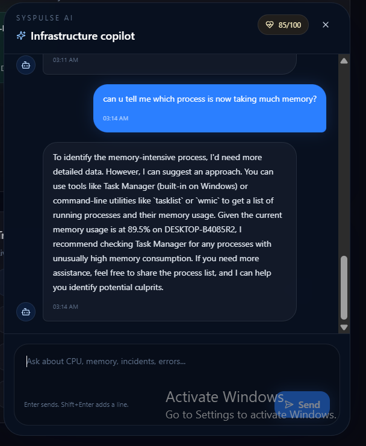
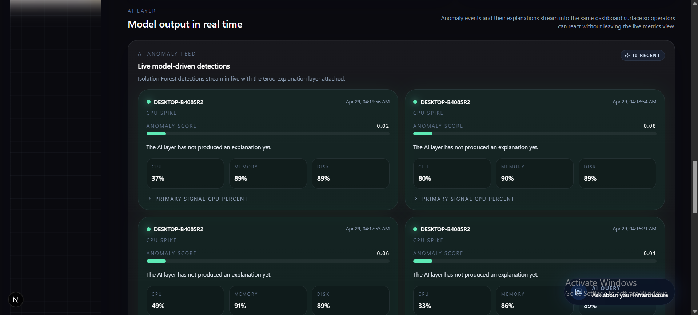
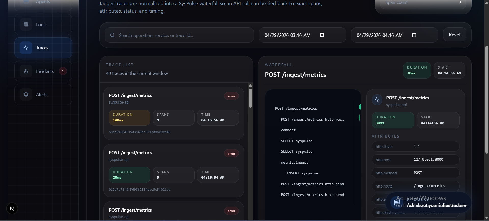
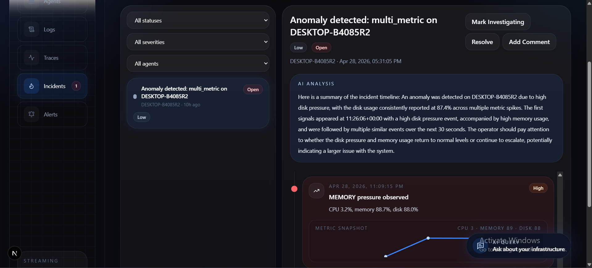
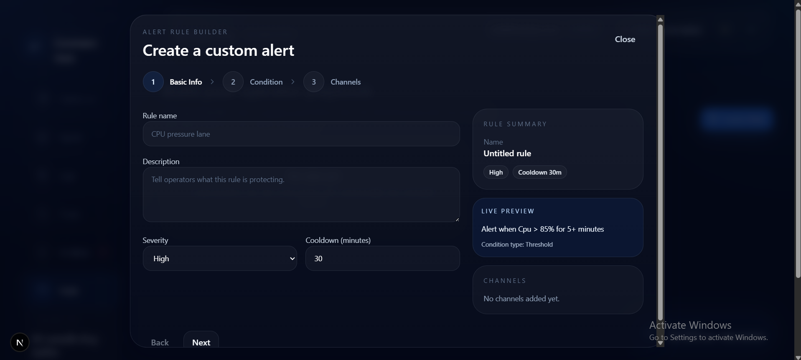

# SysPulse

AI-native infrastructure observability for teams that want metrics, logs, traces, incidents, alerts, and explanations in one self-hosted stack.

[](LICENSE)
[](https://fastapi.tiangolo.com)
[](https://nextjs.org)
[](https://www.timescale.com)
[](https://opentelemetry.io)
[](https://go.dev)
[](https://www.typescriptlang.org)
[](https://python.org)
[](https://groq.com)
[](CONTRIBUTING.md)

## Self-host in 3 commands

```bash
git clone https://github.com/sadidgit01/syspulse
cd syspulse && cp .env.example .env
make up
# Open localhost:3000 - login with demo@syspulse.io / demo123
```

---

## What is SysPulse?

SysPulse is a self-hosted observability platform for infrastructure teams. It combines live server metrics, log ingestion, anomaly detection, forecasting, alert rules, incident timelines, distributed tracing, and an SRE-style assistant in one product.

It is built for operators who want fast answers without stitching together a metrics system, log store, alert manager, trace viewer, agent installer, and AI layer by hand.

Core principles:

- Multi-tenant by default, with organization-scoped data isolation across every table and query.
- Real-time first, with WebSocket metrics and SSE streams for logs, anomalies, and incidents.
- Secure agent transport, with JWT agent identity, mTLS certificates, and HMAC-SHA256 payload signing.
- AI as an explanation layer, not a decision maker. Rules and ML detect; the LLM explains.
- Self-hostable from day one, with Docker Compose, Traefik, and automatic HTTPS support.

---

## Screenshots

Current `docs/screenshots/` inventory:

- `login.png`
- `dashboard-overview.png`
- `live-metrics.png`
- `syspulse-ai-health.png`
- `syspulse-ai-advice.png`
- `agents-heatmap.png`
- `anomaly-feed.png`
- `trace-viewer.png`
- `incident-timeline.png`
- `alert-rule-builder.png`

| Login | Dashboard |
|---|---|
|  |  |

| Live Metrics | Agents and Heatmap |
|---|---|
|  |  |

| SysPulse AI Health Summary | SysPulse AI Advice |
|---|---|
|  |  |

| Anomaly Feed | Trace Viewer |
|---|---|
|  |  |

| Incident Timeline | Alert Rule Builder |
|---|---|
|  |  |

---

## Features

### Real-Time Observability

- Real-time metrics over WebSocket
- CPU, memory, disk, and network telemetry
- 60-sample in-browser ring buffer per agent
- Agent heatmap and live status cards
- Native WebSocket fanout by organization

### Logs

- Log ingestion from agents
- TimescaleDB-backed log storage
- Live log viewer with SSE streaming
- Level, source, agent, search, and time-range filters
- Log statistics by level, source, and hourly error rate
- Correlation timeline across metrics and logs

### Correlation Engine

- Detects CPU, memory, and disk spikes against recent rolling baselines
- Matches spikes with ERROR and CRITICAL logs within a two-minute window
- Stores correlation events with severity and normalized score
- Publishes live correlation updates for the dashboard

### Machine Learning

- Isolation Forest anomaly detection
- Per-agent learned baseline instead of global thresholds
- Hourly retraining from each agent's last 24 hours of metrics
- Anomaly event storage with score, reason, details, snapshot, and explanation
- Prophet time-series forecasting for CPU, memory, and disk
- Forecast alerts when a metric is predicted to exceed 90 percent

### SysPulse AI

- Groq integration using Llama 4
- Model: `meta-llama/llama-4-scout-17b-16e-instruct`
- Infrastructure-aware chat assistant for operators
- Live fleet health score with agent count, online count, and issue summary
- Answers natural-language questions using current telemetry, not static documentation
- Reads live metrics, 60-minute trends, recent ERROR and CRITICAL logs, anomalies, forecasts, and open incidents
- Explains CPU, memory, disk, network, and incident behavior with exact numbers from the user's own infrastructure
- Gives practical SRE-style next steps when a host is under pressure
- Plain-English anomaly explanations
- Forecast explanations
- Keeps recent chat history in the dashboard and supports suggested questions for quick triage

### Incidents

- Incident timeline with status and severity
- Auto-created incidents from anomaly, forecast, and correlation triggers
- Timeline events built from metrics, logs, anomalies, correlations, comments, and status changes
- LLM-generated incident summaries
- Live incident updates over SSE
- Manual incident creation from the dashboard

### Alerts

- Alert rule builder
- Threshold rules
- Relative-change rules
- Composite AND/OR rules
- AI anomaly score rules
- Cooldowns to prevent repeated firing
- Slack alert channel
- Discord alert channel
- Custom webhook alert channel
- Email channel stub for future SMTP integration
- Push notifications for alert events

### Tracing

- OpenTelemetry instrumentation for FastAPI
- SQLAlchemy query tracing
- Manual spans for metric ingest, anomaly detection, forecasting, and LLM explanations
- OTLP collector
- Jaeger trace storage and visualization
- Built-in SysPulse trace viewer with waterfall display
- `X-Trace-ID` response headers for API request correlation

### Agents

- Production Go agent
- Cross-platform builds for Linux, Windows, and macOS
- Metrics collection with `gopsutil`
- Batched metric shipping
- Gzip payload compression
- Network delta encoding
- HMAC-SHA256 payload signing
- mTLS mutual certificate authentication
- Python development agent remains available for local testing

### Security and Access

- JWT authentication
- Rotating refresh tokens
- Redis-backed refresh token invalidation
- RBAC roles: Admin, Viewer, Alert Manager
- Invite system
- Audit log for auth events
- Organization-scoped data isolation
- Agent tokens scoped to one registered agent
- mTLS certificate issuance and rotation

### Frontend and Deployment

- Next.js 15 App Router
- TypeScript strict mode
- Tailwind CSS v4
- Zustand state store
- Recharts charts
- Dark dashboard UI
- PWA support
- Installable on mobile
- Web push subscription endpoint
- One-command local startup with Make
- One-command production deploy with Traefik and automatic HTTPS
- CLI installer: `npx syspulse-agent install`

---

## Architecture

```text
Go Agent / Python Dev Agent
  - gopsutil or psutil collectors
  - gzip batched payloads
  - HMAC-SHA256 signatures
  - mTLS certificate auth
        |
        v
FastAPI Backend
  - JWT auth and RBAC
  - agent registration
  - metrics ingest
  - logs ingest
  - WebSocket and SSE streams
  - OpenTelemetry spans
        |
        +--> PostgreSQL + TimescaleDB
        |      - organizations
        |      - users
        |      - agents
        |      - metrics hypertable
        |      - log_entry hypertable
        |      - anomaly_events
        |      - forecast_alerts
        |      - correlation_events
        |      - incidents
        |      - alert_rules
        |      - audit_log
        |
        +--> Redis
        |      - pub/sub
        |      - caching
        |      - rate limiting
        |      - token rotation state
        |
        +--> Celery
        |      - anomaly training
        |      - forecasting
        |      - correlation
        |      - alert evaluation
        |
        +--> OTel Collector --> Jaeger
        |
        v
Next.js Dashboard
  - live metrics
  - log viewer
  - incident timeline
  - alert builder
  - anomaly feed
  - forecast warnings
  - AI query box
  - trace waterfall viewer
```

---

## Stack

| Layer | Technology |
|---|---|
| Backend | FastAPI, Python 3.11, SQLAlchemy 2.0 async, Alembic |
| Database | PostgreSQL 16, TimescaleDB |
| Cache and Pub/Sub | Redis 7 |
| Background Jobs | Celery, Redis broker |
| Frontend | Next.js 15, TypeScript, Tailwind CSS v4, shadcn-style components |
| Charts | Recharts |
| State | Zustand |
| Auth | JWT, bcrypt, RBAC, rotating refresh tokens |
| ML | scikit-learn Isolation Forest, Prophet |
| LLM | Groq, Llama 4 |
| Tracing | OpenTelemetry, OTLP Collector, Jaeger |
| Agent | Go 1.22, gopsutil, mTLS, HMAC signing |
| Dev Agent | Python, psutil, httpx |
| CLI | Node.js, TypeScript, `npx syspulse-agent` |
| Deployment | Docker Compose, Traefik, Let's Encrypt |

---

## Getting Started

### Prerequisites

- Docker Desktop
- Git
- Node.js 20+
- Python 3.11+
- Make

On Windows, use PowerShell from the project root unless a command says otherwise.

### 1. Clone and configure

```bash
git clone https://github.com/sadidgit01/syspulse
cd syspulse
cp .env.example .env
```

Windows PowerShell:

```powershell
git clone https://github.com/sadidgit01/syspulse
cd syspulse
Copy-Item .env.example .env
```

Edit `.env` and set production-grade secrets before exposing the app publicly.

### 2. Start the stack

```bash
make up
```

This starts the local Docker Compose stack.

### 3. Run migrations

```bash
make migrate
```

### 4. Seed the demo account

```bash
make seed
```

The seed script creates:

- Email: `demo@syspulse.io`
- Password: `demo123`
- Organization: `SysPulse Demo`

It also prints the organization token used to register agents.

### 5. Open the dashboard

Open:

```text
http://localhost:3000
```

Login with:

```text
demo@syspulse.io / demo123
```

---

## Agent Install

Install the production Go agent with the CLI:

```bash
npx syspulse-agent install --server http://localhost:8000 --token <org_token>
```

The CLI:

- detects OS and architecture
- registers the host as an agent
- downloads the correct Go agent binary
- installs mTLS certificates
- saves local config in `~/.syspulse`
- installs a background service
- verifies the agent is reporting

Check status:

```bash
npx syspulse-agent status
```

Rotate mTLS certificates:

```bash
npx syspulse-agent rotate-cert
```

For development, the Python agent is available at:

```text
apps/agent/python_agent
```

---

## Local Development

Run services manually when working outside Docker.

### API

```bash
cd apps/api
python -m venv venv
source venv/bin/activate
pip install -r requirements.txt
uvicorn app.main:app --host 0.0.0.0 --port 8000 --reload
```

Windows PowerShell:

```powershell
cd apps\api
python -m venv venv
.\venv\Scripts\activate
pip install -r requirements.txt
uvicorn app.main:app --host 0.0.0.0 --port 8000 --reload
```

### Frontend

```bash
cd apps/web
npm install
npm run dev
```

### Celery

Worker:

```bash
cd apps/api
celery -A app.tasks.celery_app worker --loglevel=info
```

Windows PowerShell:

```powershell
cd apps\api
celery -A app.tasks.celery_app worker --loglevel=info -P solo
```

Beat scheduler:

```bash
cd apps/api
celery -A app.tasks.celery_app beat --loglevel=info
```

### OpenTelemetry

```bash
docker compose up jaeger otel-collector -d
```

Jaeger UI:

```text
http://localhost:16686
```

For a locally running API, set this in `apps/api/.env`:

```env
OTEL_ENABLED=true
OTEL_EXPORTER_OTLP_ENDPOINT=http://localhost:4317
```

For an API running inside Docker, use:

```env
OTEL_EXPORTER_OTLP_ENDPOINT=http://otel-collector:4317
```

---

## Production Deploy

SysPulse includes a production Docker Compose file with:

- Postgres
- Redis
- API
- Web
- Celery worker
- Celery beat
- Traefik
- automatic HTTPS through Let's Encrypt
- OTel collector
- Jaeger

Configure `.env`:

```env
DOMAIN=yourdomain.com
SECRET_KEY=generate_with_openssl_rand_hex_32
POSTGRES_PASSWORD=change_this_strong_password
GROQ_API_KEY=get_free_at_console_groq_com
VAPID_PUBLIC_KEY=generate_with_pywebpush
VAPID_PRIVATE_KEY=generate_with_pywebpush
```

Deploy:

```bash
make prod-deploy
```

Manage production:

```bash
make prod-up
make prod-logs
make prod-down
```

---

## Project Structure

```text
syspulse/
├── apps/
│   ├── api/
│   │   ├── app/
│   │   │   ├── models/
│   │   │   ├── routers/
│   │   │   ├── schemas/
│   │   │   ├── services/
│   │   │   ├── tasks/
│   │   │   └── telemetry.py
│   │   ├── alembic/
│   │   ├── Dockerfile
│   │   └── requirements.txt
│   ├── web/
│   │   ├── app/
│   │   ├── components/
│   │   ├── hooks/
│   │   ├── lib/
│   │   ├── public/
│   │   └── types/
│   └── agent/
│       ├── go_agent/
│       └── python_agent/
├── packages/
│   └── cli/
├── infra/
│   ├── nginx/
│   ├── otel/
│   └── traefik/
├── docs/
├── docker-compose.yml
├── docker-compose.prod.yml
├── Makefile
└── README.md
```

---

## API Surface

Key endpoint groups:

- `POST /auth/register`
- `POST /auth/login`
- `POST /auth/refresh`
- `GET /auth/me`
- `POST /auth/invite`
- `POST /auth/accept-invite`
- `POST /agents/register`
- `GET /agents`
- `GET /agents/{agent_id}/cert`
- `POST /agents/{agent_id}/rotate-cert`
- `POST /ingest/metrics`
- `POST /ingest/logs`
- `GET /metrics/{agent_id}`
- `GET /logs`
- `GET /logs/stats`
- `GET /logs/stream`
- `GET /correlate`
- `GET /correlate/events`
- `GET /anomalies`
- `GET /forecasts`
- `POST /ai/query`
- `GET /ai/health-score`
- `GET /incidents`
- `GET /incidents/stream`
- `POST /incidents`
- `GET /alert-rules`
- `POST /alert-rules`
- `POST /alert-rules/{rule_id}/test`
- `POST /push/subscribe`
- `WS /ws/{org_id}`

---

## Security Model

SysPulse separates human access from agent access.

Human users authenticate with JWT access tokens and rotating refresh tokens. Roles are enforced through RBAC:

- Admin
- Viewer
- Alert Manager

Agents authenticate with scoped JWT agent tokens. Production agent traffic also supports:

- mTLS certificate authentication
- org-scoped certificate authority
- certificate rotation
- HMAC-SHA256 payload signatures
- gzip-compressed payloads

Every persisted business table includes `org_id`, and queries are filtered by organization.

---

## Comparison

| Feature | SysPulse | Datadog | Grafana + Prometheus |
|---|---|---|---|
| Self-hostable | Yes | No | Yes |
| Open source friendly | Yes | No | Yes |
| Live metrics | Yes | Yes | Yes |
| Log ingestion | Yes | Yes | Requires Loki |
| Built-in incidents | Yes | Yes | Requires extra tooling |
| Built-in trace viewer | Yes | Yes | Requires Tempo or Jaeger |
| ML anomaly detection | Per-agent Isolation Forest | Paid platform feature | External setup |
| Forecasting | Prophet | Paid platform feature | External setup |
| LLM explanations | Llama 4 via Groq | No native equivalent | External setup |
| Agent installer | `npx syspulse-agent install` | Vendor agent | Manual setup |
| mTLS agent auth | Yes | Vendor managed | Manual setup |
| Multi-tenant isolation | Yes | Yes | Manual setup |
| PWA dashboard | Yes | No | No |

---

## Roadmap

- ✅ Phase 1 - Core FastAPI backend, TimescaleDB metrics, WebSocket dashboard
- ✅ Phase 2 - JWT auth, RBAC, organizations, invite system, CLI foundation
- ✅ Phase 3 - Log ingestion, live log viewer, log stats, correlation queries
- ✅ Phase 4 - Isolation Forest anomalies, Prophet forecasts, Groq Llama 4 explanations
- ✅ Phase 5 - Production Go agent, mTLS certificates, HMAC signing, CLI install flow
- ✅ Phase 6 - OpenTelemetry tracing, Jaeger, built-in trace viewer
- ✅ Phase 7 - Incident timeline, alert rule builder, PWA, push notifications, one-command deploy

---

## Development Commands

```bash
make up
make down
make logs
make migrate
make seed
make restart-api
make shell-api
make shell-db
make prod-up
make prod-down
make prod-logs
make prod-deploy
```

---

## Contributing

Contributions are welcome. Please open an issue first for larger changes so implementation details can be discussed before code lands.

```bash
git checkout -b feature/your-feature
git commit -m "feat: add your feature"
git push origin feature/your-feature
```

---

## License

MIT. See [LICENSE](LICENSE) for details.

---

Built by [Sadid](https://github.com/sadidgit01).
